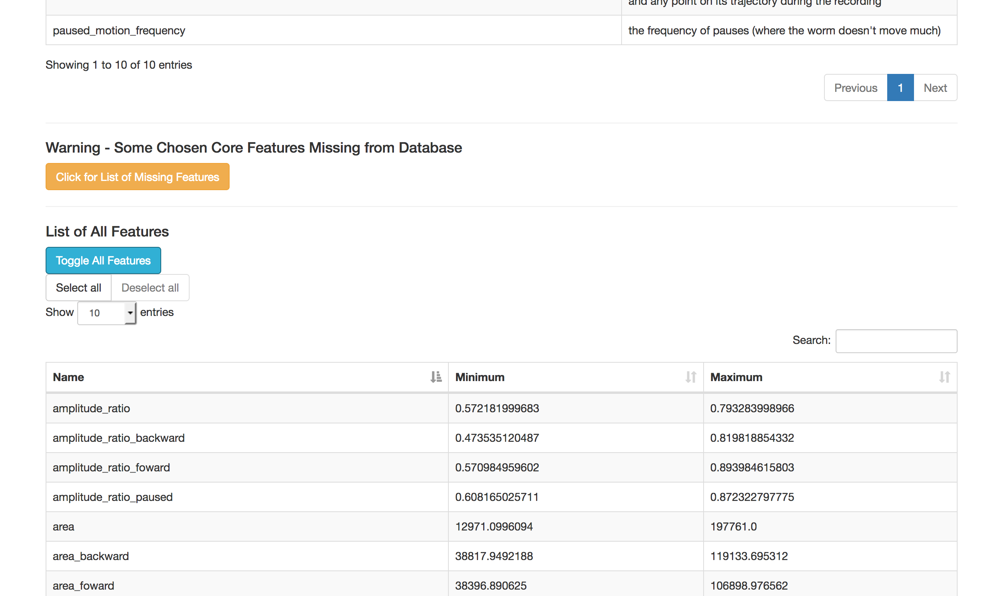
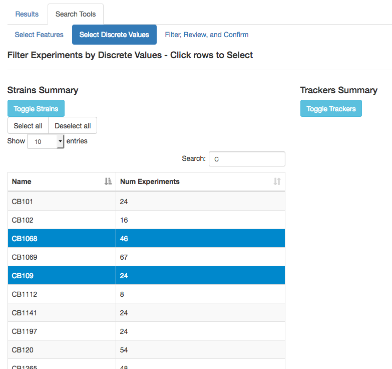
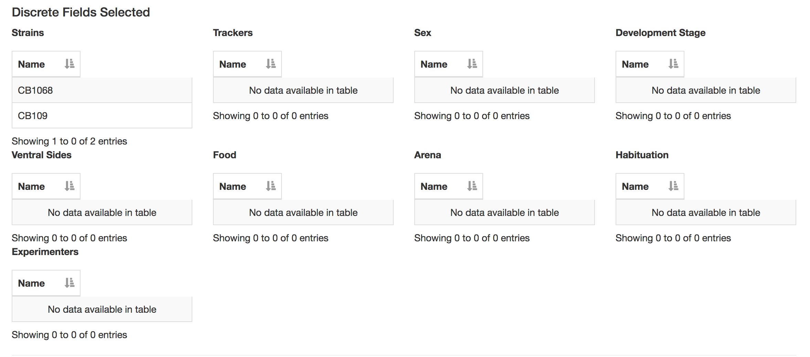
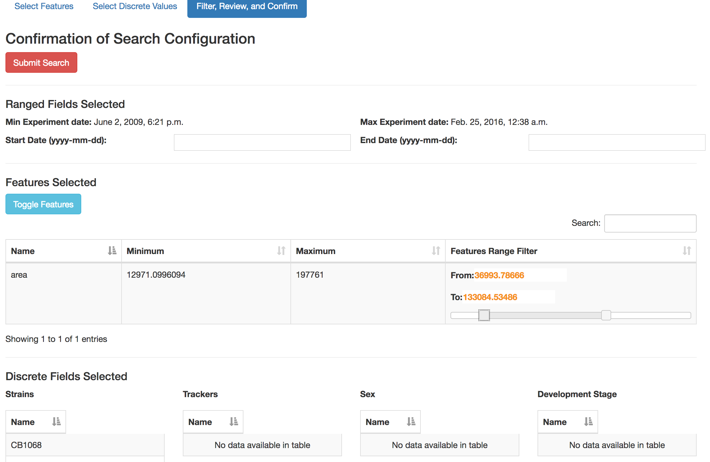
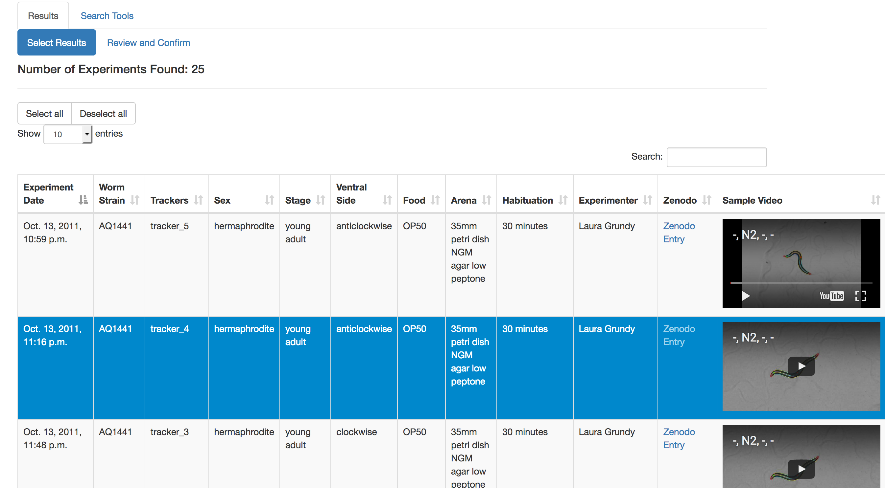
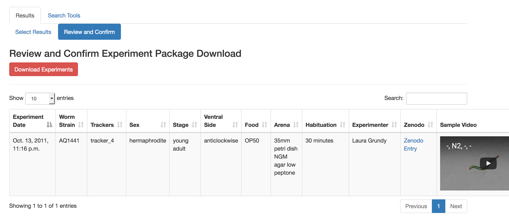
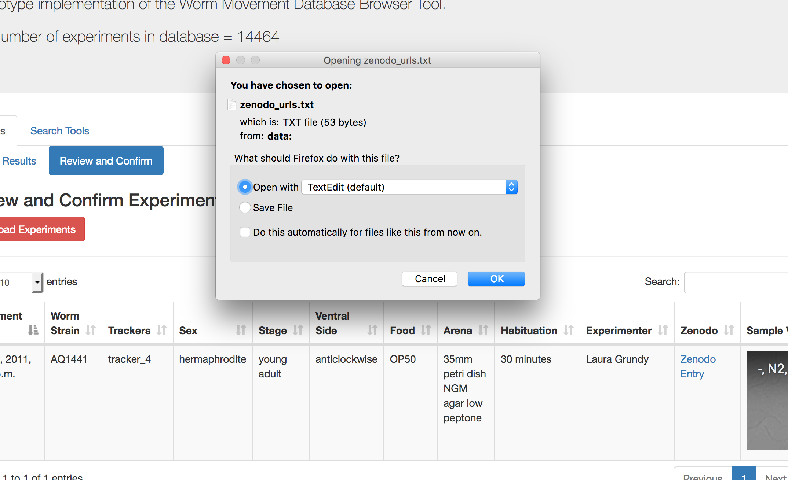

# Worm Database Interface Documentation

This document covers each tab in the interface.

## Main Landing Page

The landing page hosts the two main tabs of interface-use features. "Results" hosts tabs for interactions with filtered lists of experiment records in the database. "Search Tools" hosts tabs for users to select features to filter experiments on, and to specify parameter limits.

The page also shows how many experiments are in the database.

## Search Tools -> Select features

The screenshot above shows the list of core features (determined by the maintainers of the database) along with a description of what they mean. These represent commonly-used metadata profiles of the worm's movement in any experiment, and ones the maintainers consider important as a search filter. Below this table is a full list of metadata features that can also be selected. This table is initially hidden, but can be toggled. This is shown in the screenshot below.

The full features table has an autocomplete search feature that allows the user to locate feature names by sub-strings (e.g. "amplitude" to locate all relevant features associated with amplitude.) Both the full features table and the core features table allow users to select or deselect all rows in the table via buttons above the table.

Both tables are also linked. Selecting a row in one table will also cause the corresponding feature to be selected in the other table, as long as the feature is common to both tables.

Selecting and deselecting rows in either of these two tables also automatically updates a final table in the "Filter, Review, and Confirm" tab. This will be described in more detail later, but will look something like the screenshot below.

As can be seen in the screenshot, that is where the user can then select the range of values for filtering on the experiments.

## Search Tools -> Select Discrete Values

In addition to filtering experiments by features parameters, the tool allows users to filter by specific discrete values over multiple categories like worm strains, sex, and worm development stage.

Each category has its own table, with auto-complete search (the screenshot above shows a restriction on anything that has a "C" in its name.) Each table also has buttons for selecting or deselecting all rows. All tables are initially hidden, and can have their visibility toggled.

Like the features tables in the preceding section, selecting or deselecting rows in tables on this tab will automatically update mirrored tables in the "Filter, Review, and Confirm" tab like in the following screenshot.

## Search Tools -> Filter, Review, and Confirm

The final tab allows the user to filter the experiments by the dates in addition to providing slider bars to each selected feature. There are no additional changes that can be made to discrete values, so these are listed in the bottom as a way for users to review them.

Note that there is currently no error checking on the date input. Also because of the way sliders are implemented, they are deliberately designed to allow filter values slightly below the minimum, and slightly above the maximum. Users should not be alarmed to see that.

Once the user is satisfied with the filter settings, clicking on the "Submit Search" button will trigger the necessary database operations, and present the results in the "Results" tab described later!

## Results -> Select Results

After a valid filter has been applied to the database, this tab will display a table of experiment records, including the link to its movement data residing on a Zenodo resource, and an embedded short youtube video highlighting a sample movement sequence.

Clicking on a row selects or deselects experiment records. This is automatically reflected in the final list in the "Review and Confirm" tab. Buttons to select or deselect all rows are available here.

## Results -> Review and Confirm

The table shown in this tab is essentially a mirror of selected rows in the "Select Results" tab. The user may review the list of experiments desired before clicking on the "Download Experiments" button. Currently this is a misnomer, clicking on the button will simply collect all the links to Zenodo data in the final list, and produce a text file (named zenodo_urls.txt) with each URL in its own line. This file can be piped to another download service like wget or sftp.

