# Worm Database Features Documentation

This reference document describes how one may use key features and components implemented in the interface. For a use-case tutorial, please refer to [this document](Tutorial.md).

## Table of Contents
1. [Navigation Bar](#navigation-bar)
2. [Search Bar](#search-bar)
3. [Crossfilter](#crossfilter)
4. [Browse and Filter Database](#browse-and-filter-database)
5. [Get Zenodo Data](#get-zenodo-data)
6. [Get Features Means Data](#get-features-means-data)
7. [Changing Crossfilter Features](#changing-crossfilter-features)
8. [Standard DataTables](#standard-datatables)
9. [WCON Viewer Tool](#wcon-viewer-tool)
10. [Upload Data Form](#upload-data-form)
11. [Providing Feedback](#providing-feedback)

## Navigation Bar

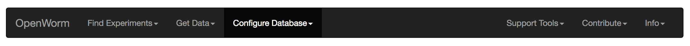

The tool's navigation bar is generally laid out as follows. The leftmost button is our brand, and opens the [Openworm](https://openworm.org) web portal in a new browser tab. Menu options on the left are database tool options. The general rule of thumb is that users can navigate between these options without interfering with the use-state of the tool.

Database Tool:
* **Find Experiments -> Crossfilter**: Brings up the [Crossfilter](#crossfilter) tool.
* **Find Experiments -> Browse and Filter Database**: Brings up the tool allowing users to [browse and filter the database](#browse-and-filter-database).
* **Get Data -> Zenodo Data**: Allows users to [get experiment data files](#get-zenodo-data) from the Zenodo repository.
* **Get Data -> Features Means**: Allows users to [download features means information](#get-features-means-data) associated with experiments.
* **Configure Database -> Change Crossfilter Features**: Lets users [change the set of features](#change-crossfilter-features) they can crossfilter against.
* **Configure Database -> Clear All Settings**: Resets the database to its initial default state.

The right side of the navigation bar provide links to tools and information outside of the main tool. These generally open in new browser tabs. The form of the navigation bar also changes so the only option on the left side of the bar allows the user to return to an initial instance of the main database tool as if a reset were requested.

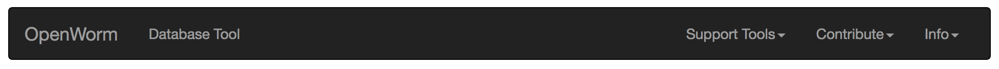

Auxiliary Tools:
* **Database Tool**: Opens a new instance of the database tool in the current browser tab.
* **Support Tools -> WCON Movement Viewer**: Opens the [WCON viewer](#wcon-movement-viewer).
* **Contribute -> Upload your Data**: Opens an embedded Google Form to [request data upload](#upload-your-data).
* **Contribute -> Give Feedback**: Opens an embedded Google Form to [forward feedback](#give-feedback).
* **Contribute -> Contributors List**: Displays a page listing database contributors.
* **Info -> Documentation**: This document hosted on Github.
* **Info -> Source Code**: Link to the Github repository.
* **Info -> Release Notes**: Information about current release features.

## Search Bar

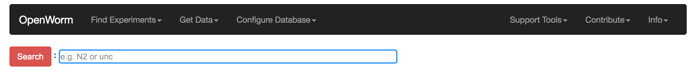

The search bar is an ever-present feature of the database tool users can apply at any time in the workflow. Its basic functionality is to allow users to specify a small set of database field constraints so they may look at data familiar to them quickly (e.g. specific strain identifiers, or specific genes.)

:warning: Note that submitting a new search will bring in a new subset of database information to the tool from the server. This currently necessitates that any crossfilter state be reset after the operation.

The semantic rules that currently apply to search terms are as follows:

1. Values from the same fields are treated as "inclusive ORs." E.g. "genes=ocr-3, genes=pqn-66," means the user wishes to find experiments where the worms can be of genes "ocr-3" or "pqn-66".

2. Values from different fields are treated as "AND" requirements. E.g. "genes=ocr-4, alleles=tm2173," means the user wishes to find experiments where the worms are of genes "ocr-4" and at the same time of alleles "tm2173."

:warning: We do plan on supporting more flexible AND/OR combinations for the future. Please do give feedback if there are particularly important use-cases for which this should be a priority.

The search bar has autocomplete features. As the user types (e.g. "acr" in the above image,) the tool will list all the partial matches as well as the field categories these partial matches belong to. Users may then choose to click on the matches they want, or continue typing.

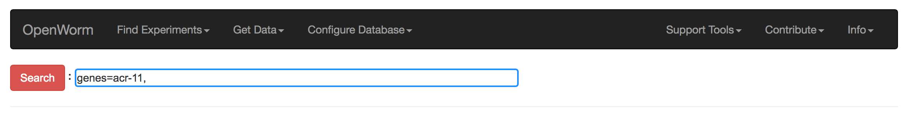

On selection the tool fills out the field category for the user, and adds a comma separator.

:warning: Note that the user is not forced to select options listed for the search bar to work. Using the above image as an example, the user could type "genes=acr-11," into the text box.

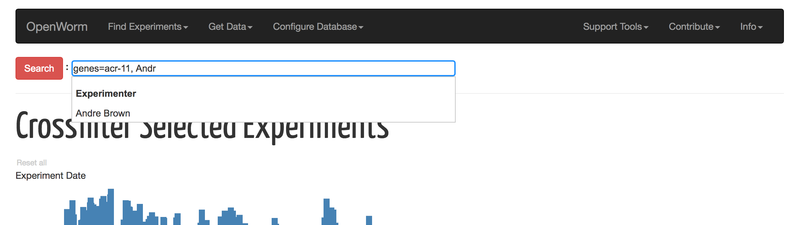

The search bar will also autocomplete for multiple entries. The above image is an example of autocomplete in action for a partial match on an Experimenter after a gene type has been confirmed.

When ready the user can hit "Enter" or click on the "Search" button to begin the search. The bar attempts to validate the string supplied, and will reject any poorly-formed values (e.g. unknown field names.)

## Crossfilter

**_Find Experiments_** -> **_Crossfilter_** brings us to this tool. This is the default view shown to users when the tool is initialized.

The crossfilter tool lets users rapidly and dynamically look for experiment records based on ranged parameters. The current tool has two fixed parameters in the form of the date the experiment was run, and the age of the worm recorded. Also as a default a small subset of core worm movement features are also included. The set of features used as ranged parameters for crossfiltering can be changed by the user using the [Change Crossfilter Feature](#change-crossfilter-features) menu option.

Each bar chart has an x-axis representing the range of values for the parameter it represents. The height of each bar represents the relative number of records that are constrained by the value-range of the corresponding bar.

To get started, the user can click on any part of the bar chart and drag the mouse along the x-axis. This causes the tool to select a range corresponding. Depending on which experiment records satisfy this range of values, the heights of the bars in other charts will also respond as records are eliminated from the total constraints represented by all active charts. In the image above, constraints are being applied to the date and the worm age, but nothing else.

A "Reset all" link is available at the top left corner of the tool at all times. Clicking on this will reset the ranges on all charts. Also each chart that has an active range selected will also have a "reset" link appear next to its label. Clicking on the chart's "reset" link will reset the range only for that chart.

A 20-entry subset of the constrained experiments are displayed as a dynamic preview of the user's choices. This table changes as the user changes the ranges, and is intended to give an intuitive sense of the experiments that are found. The [Zenodo download](#zenodo-data) tool has a full browsable preview with better search and sort features for records found by this process.

## Browse and Filter Database

**_Find Experiments_** -> **_Browse and Filter Database_** brings us to this tool. The view features an array of lists for each available discrete field value type users can choose. Each list is hidden by default, and may be toggled as needed. This is a good tool for users unfamiliar with the contents of the database to browse for records that may be of interest to them.

Each toggled list supports all DataTables features as described in section [Standard DataTable](#standard-datatables). A good way to
select sets of discrete values is to use the "Search:" box, and then the "Select Searched" button to include them into the selection. The example below shows how "all strains CB" can get selected. It is safe to use the "Search:" box to find another set of strains to select on, without losing the earlier selection.

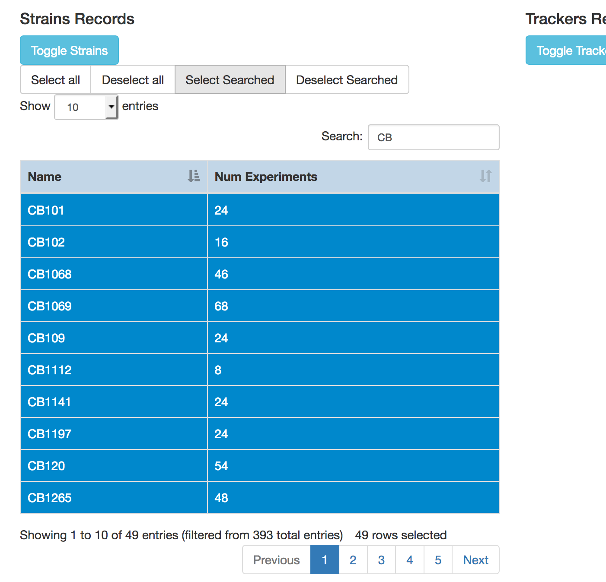

The semantic rules for filter selections using this browsing tool are the same as those for the [Search Bar](#search-bar).

Clicking on the "Apply Filter" button at the top of the tool sends the user's filter request to the database server.

:warning: Note that submitting a new search will bring in a new subset of database information to the tool from the server. This currently necessitates that any crossfilter state be reset after the operation.

## Get Zenodo Data

**_Get Data_** -> **_Zenodo Data_** brings us to this tool. The tool consists of two parts - a browsable preview table that can be generated on demand; and two options by which users can download specific datasets.

### Browsable Preview Table

The "Click to Preview Selected Experiments" button produces a browsable and searchable table listing all of the experiments found by crossfilter. Each row of this table represents an experiment file associated with a selected experiment. Youtube sample video embeds are also included where available. This browsable table supports all DataTables features as described in section [Standard DataTable](#standard-datatables).

### Two Ways to Get Data

The first mechanism to acquire experiment data files involve generating a list of URLs users can copy and paste into third-party download software or plugins. Users can do this by clicking on the "Generate File Data URLs" button. This creates a textbox with a list of URLs as shown above.

Users may select and copy individual lines, and paste them into browser navigation bars. They can also use 3rd party plugins like this download plugin (e.g. [Tab Save](https://github.com/lmmx/tabsave/)) for Chrome shown below.

The second mechanism has our tool generate a download package ("movement_data_download_package.zip") for POSIX/Linux/MacOSX systems. This package contains:

  * A bash shell download script
  * A file containing download data based on zenodo ids and file names.  
  * Instructions.

Using the download script on a Linux machine will make use of wget to download all files into a folder structure corresponding to zenodo ids.

:warning: The first mechanism is more suited to smaller sets in the search results, and even though users may select-all in cut-and-paste operations, they should be warned that the database does not guarantee that file names are unique. The second mechanism is a batch process with somewhat better recovery and data integrity support, and ought to work better for very large datasets resulting from the search.

:warning: Unlike the other forms of data acquisition, these will **NOT** bring in a new subset of database information to the tool from the server. Any crossfilter state remains active after these operations.

## Get Features Means Data

**_Get Data_** -> **_Features Means_** brings us to this view. To download a csv file containing features metadata, users can first select the set of features using the "Select Features" table. Features are toggled by clicking on appropriate row. The features chosen here are orthogonal to the features used as parameters in the crossfilter tool. This table supports all DataTables features as described in section [Standard DataTable](#standard-datatables).

When satisfied with the selection, the "Download Features Means Metadata" button sends the request to the server. The experiments with features data will correspond to the set of experiments found earlier using the crossfilter tool.

:warning: The download can take a bit of time, depending on the number of features and experiments selected. Users may have to wait around a minute to get the entire database with all features.

:warning: Note that this operation necessitates communication with the server, and forces any crossfilter state to be reset after the operation. Future versions of this tool may be able to preserve crossfilter state however.

When successful a "results.csv" file will be generated and downloaded to the user's local machine. This file can then be import into a spreadsheet.

The data acquired consists of columns including the given name for the experiment, the strain, the gene, the allele, the zenodo id, the time stamp of the experiment, the age of the worm in days, and a column for each feature selected.
Each row represents an experiment and the rows are sorted by ascending strain values.

## Changing Crossfilter Features

**_Configure Database_** -> **_Change Crossfilter Features_** brings us to this tool. At the top of the page is a list of commonly-used "core" features. Users may click on any row to toggle selection.

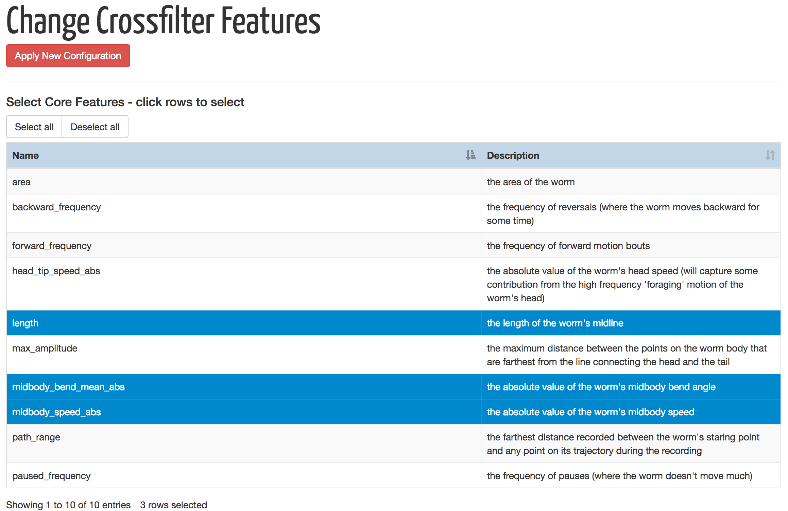

At the bottom of the page is an option to select from the full list of features. Start by toggling the appearance of the list using the button "Toggle All Features Selection". The list supports all DataTables features as described in the section [Standard DataTable](#standard-datatables).

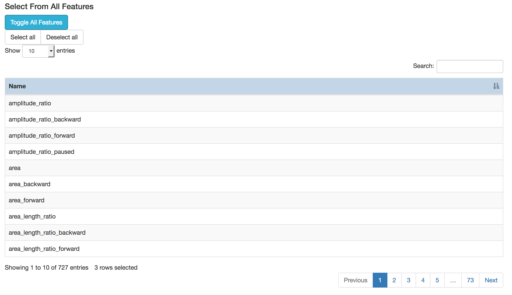

:warning: Because the core features list is a subset of the full features list, both features selection tables are synchronized for selection purposes. Users may safely select or de-select on either table, and the appropriate row in the other table will become selected or unselected.

## Standard DataTables

The database interface tool makes extensive use of [standard
DataTables](https://datatables.net/). The most common features can be described with respect to the following table:

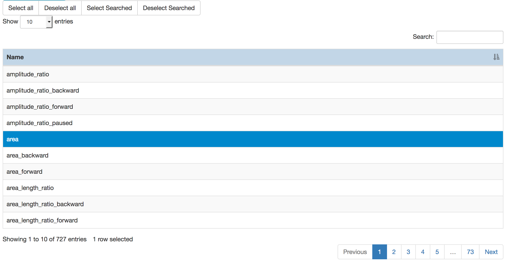

1. Clicking on the header of any column allows users to change the order rows are displayed based on how DataTables treats the natural sorting order for values in the column. The sorting can be toggled between ascending and descending.

:warning: We currently do not support sorting over multiple columns.

2. Clicking on a row may allow a row to be selected. A selected row shows up highlighted in blue. This feature is not always enabled.

3. Buttons may appear at the top of the table to allow for more flexible selection options. These are "Select All", "Deselect All", "Select Searched", and "Deselect Searched". Not all buttons are enabled for all tables.

4. Below the selection buttons (if any) is an option for users to show more or fewer rows. Enabled options are 10, 25, 50, and 100.

5. On the top right corner of the table is the "Search:" box. Enter text to make the table display only rows that contain text (in any column) which matches the text in the box. DataTables will dynamically modify the table as the text is entered.

:warning: We currently do not handle exact matches, nor allow the user to choose specific columns for which the text is to be matched.

6. On the bottom left corner of the table is a summary informing the user how many rows are being currently displayed, the total number of rows in the table, and the number of rows currently selected across
the full table (need not be currently visible).

7. On the bottom right corner of the table is an interface that allows users to browse pages of the table.

## WCON Viewer tool

**_Support Tools_** -> **_WCON Movement Viewer_** brings us to this tool. The tool opens in a new window to avoid disruption to the state of the main database tool. The initial view loads a default example worm. A link to a larger WCON data file hosted on Zenodo is provided for users to try uploading to this tool if they do not have WCON files of their own.

Clicking on the "UPLOAD ANOTHER FILE" button expands a drag-and-drop area where users may drag WCON files they possess on their local machines.

Upon doing so the tool will attempt to parse and validate the schema of the uploaded WCON file (which are JSON files.)

:warning: Schema Validation Errors aren't always the end of the world. Often the viewer will continue to work in spite of some validation errors.

In the visualization box, the red dot represents the head of the worm, and the blue line represents its body. The body's articulation can vary depending on the data. The grey line represents the worm's track over time. More than one worm may be found in a WCON file. If so, this tool will allow users to choose the worm to visualize by the drop-down selection under the "PICK A WORM" label. Users may pause and restart the animation at any time. The middle mouse scroll and certain trackpad gestures allow the user to zoom in and out inside the view.

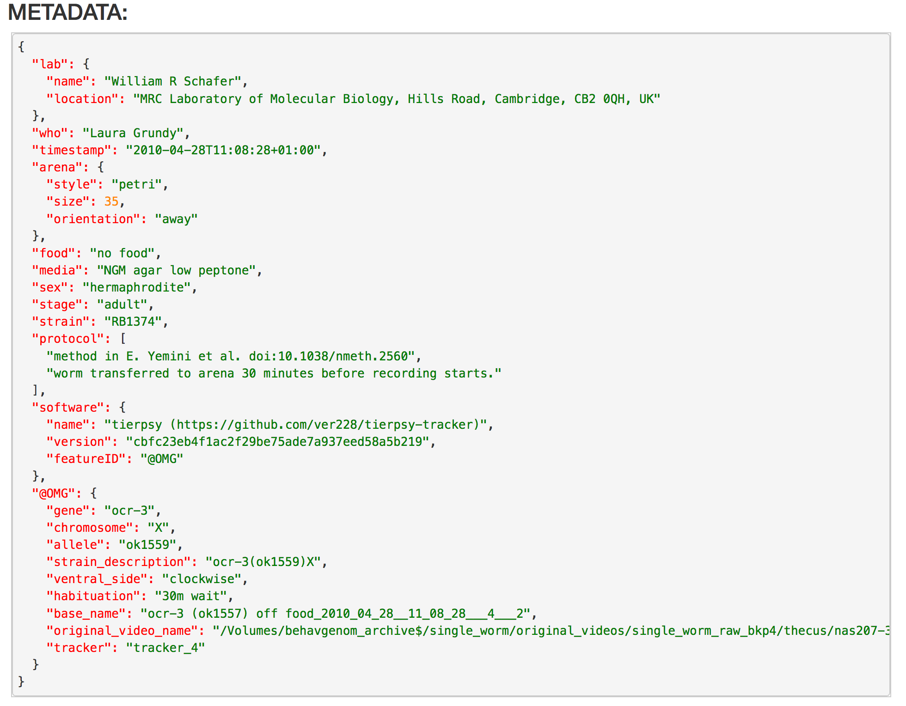

Below the main visualization, metadata information associated with the data file is presented, along with the units used, and details about each worm in the loaded WCON file. Multiple per-worm data can be seen in the example image below, with different IDs, data durations, and articulation information.

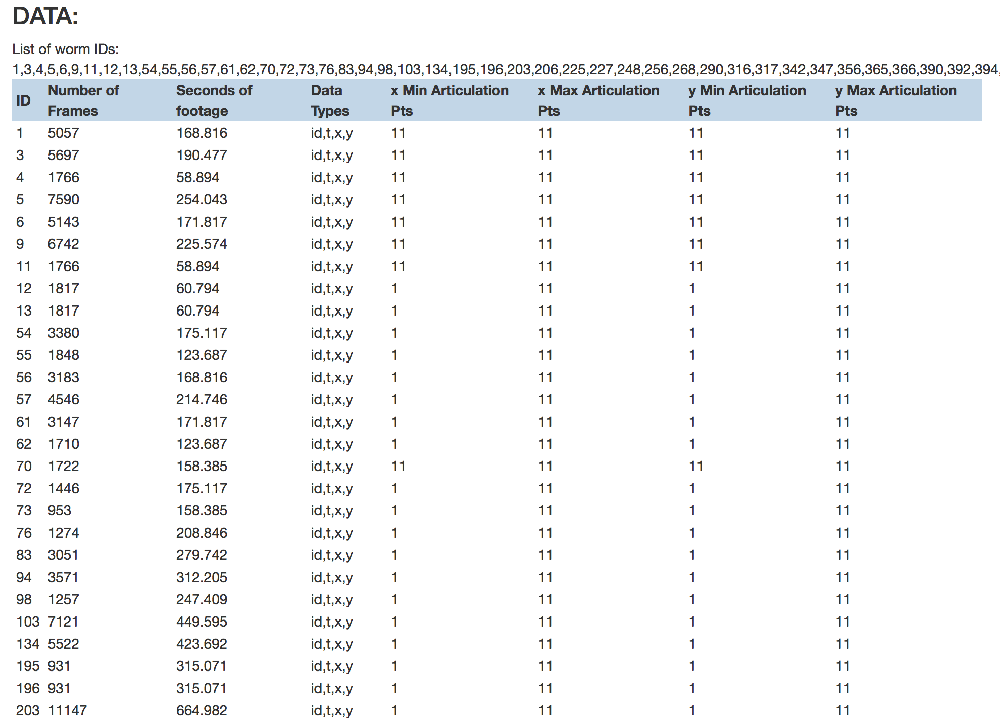

:warning: As of this writing, this viewer tool may not fully handle all possible forms of valid WCON files. We are working toward full format compatibility in future work. The viewer will however handle the most common forms.

## Upload Data Form

**_Contribute_** -> **_Upload your Data_** takes us to the following embedded Google Form. The only required field is the contributor's contact email.

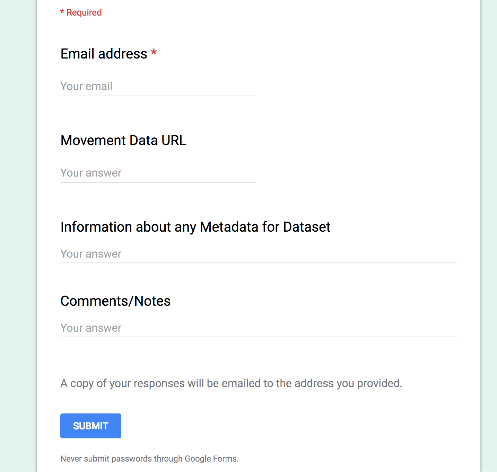

The idea is for contributors to send a request to us with information about the dataset, and how we may find it. There will be instructions on the kinds of metadata that are minimally required for creating a WCON format representing that data.

On form completion via the "Submit" button, an acknowledgement email will be sent to the contact, and we will be notified. We will get in touch with contributors as soon as we can in response to the receipt of a request, and work with them to package the data, and include it into the database and place the data into the community's Zenodo repository.

Contributions will be properly acknowledged.

:warning: As of this writing, we are still working on a good set of instructions for this process. As such the instructions may not show up in full when the form is accessed. Please do not let the lack of instructions hinder any requests.

## Providing Feedback

**_Contribute_** -> **_Give Feedback_** takes us to the following embedded Google Form. The required fields are the user's contact email, and feedback content. On form completion via the "Submit" button, an acknowledgement email will be sent to the contact.

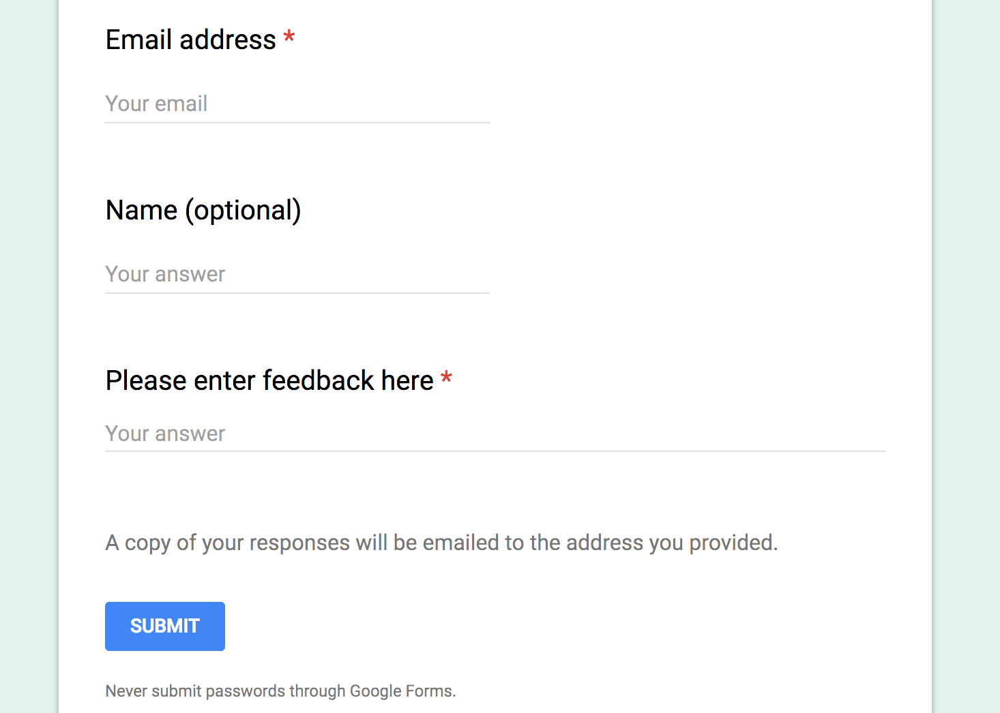
