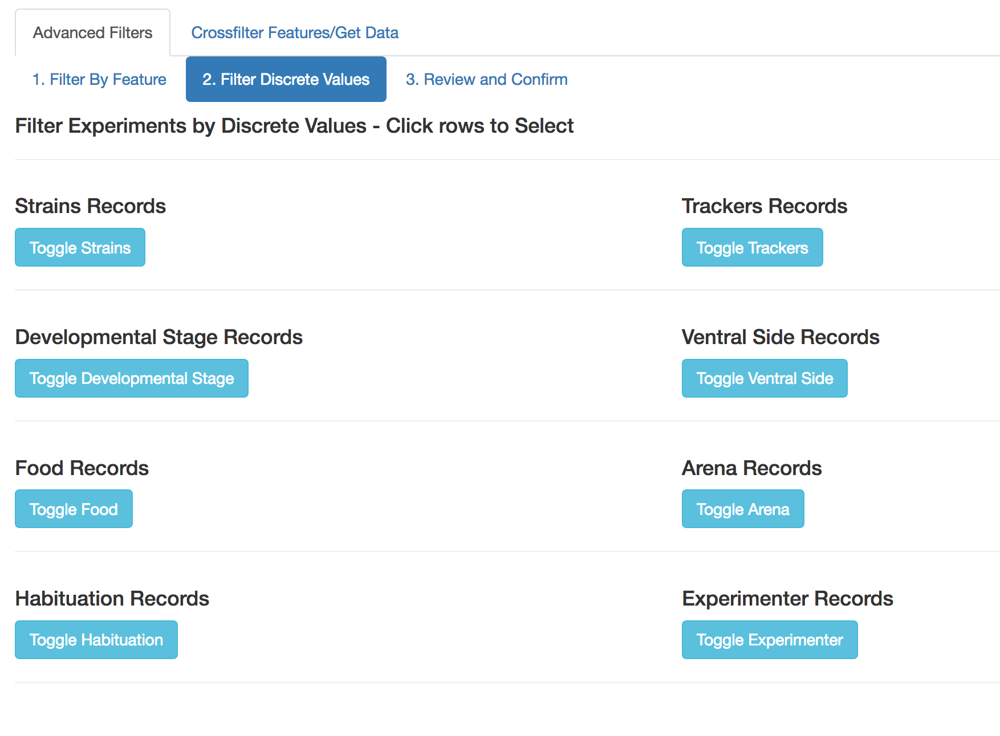
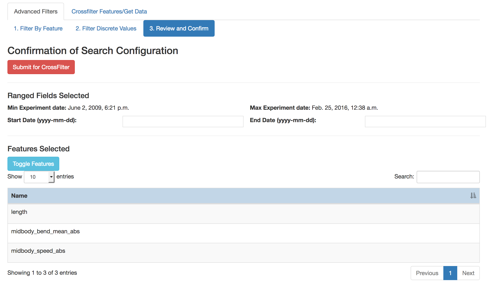

# Worm Database Features Documentation

This document describes how one may use key features and components
implemented in the interface.

## Advanced Features

This feature is contained in the "Advanced Features" top-level tab. It
is divided into three activities, and is intended to allow users to:

1. enable crossfiltering using a different set of features than the
ones provided as default when the interface is first loaded.

2. constrain the database records that are presented for
crossfiltering in the [main workflow](Tutorial.md). Constraints can involve specific
discrete fields values (e.g. strain = "CB"), and date range.

3. review the different set of features chosen for crossfilter, and
the set of discrete field constraints prior to submitting the
constraints for crossfiltering in the main workflow.

### Select Features for Crossfilter

This activity happens under the first tag labelled "1. Filter By
Feature". At the top of the page is a list of commonly used "core"
features. Users may click on any row to toggle selection.

At the bottom of the page is an option to select from the full list of
features. Start by toggling the appearance of the list using the
button "Toggle All Features". The list supports all DataTables
features as described in the section [Standard
DataTable](#standard-datatables).

:warning: Both features selection tables are synchronized for
selection purposes. Users may safely select or de-select on either
table, and the appropriate row in the other table will become selected
or unselected.

### Select Discrete Values for Crossfilter

This activity happens under the second tag labelled "2. Filter
Discrete Values". The page features an array of lists for each
available discrete value type users can constrain. The lists are
hidden by default and toggled as needed.

Each toggled list supports all DataTables features as described in
section [Standard DataTable](#standard-datatables). A good way to
select sets of discrete values is to use the "Search:" box, and then
the "Select Searched" button to include them into the selection. The
example below shows how "all strains CB" can get selected. It is safe
to use the "Search:" box to find another set of strains to select on,
without losing the earlier selection.

### Review and Confirm Crossfilter

This activity happens under the third tag labelled "3. Review and
Confirm". On this page users may browse all the elements selected from
the prior two tabs. In addition users may also choose to further
constrain the database records that will be crossfiltered by
specifying a minimum or maximum date value or both. 

:warning: Date formats must be in the form yyyy-mm-dd.

Review lists for crossfilter features set, and discrete value
constraints appear in lists that support search and browsing, but the
ability to select or de-select is disabled. 

:warning: Should users change their minds, they should return to the
previous tabs to modify their selections. Switching between tabs will
not impact the state of the interface tool.

Users may toggle the visibility of either section for cleaner browsing
or review experience.

When users are satisfied with their selections, clicking on the
"Submit for Crossfilter" button will return them to the standard
workflow, but with the crossfilter features modified and records
constrained. The following image shows the crossfilter page
constrained to only records with strains prefix CB, and crossfiltered
on area and path_range values.

## Standard DataTables

The database interface tool makes extensive use of [standard
DataTables](https://datatables.net/). The most common features can be
described with respect to the following table:

1. Clicking on the header of any column allows users to change the
order rows are displayed based on how DataTables treats the natural
sorting order for values in the column. The sorting can be toggled
between ascending and descending.

:warning: We currently do not support sorting over multiple columns.

2. Clicking on a row may allow a row to be selected. A selected row
shows up highlighted in blue. This feature is not always enabled.

3. Buttons may appear at the top of the table to allow for more
flexible selection options. These are "Select All", "Deselect All",
"Select Searched", and "Deselect Searched". Not all buttons are
enabled for all tables.

4. Below the selection buttons (if any) is an option for users to show
more or fewer rows. Enabled options are 10, 25, 50, and 100.

5. On the top right corner of the table is the "Search:" box. Enter
text to make the table display only rows that contain text (in any
column) which matches the text in the box. DataTables will dynamically
modify the table as the text is entered.

:warning: We currently do not handle exact matches, nor allow the user
to choose specific columns for which the text is to be matched.

6. On the bottom left corner of the table is a summary informing the
user how many rows are being currently displayed, the total number of
rows in the table, and the number of rows currently selected across
the full table (need not be currently visible).

7. On the bottom right corner of the table is an interface that allows
users to browse pages of the table.
