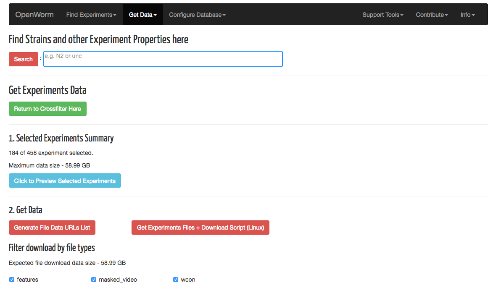
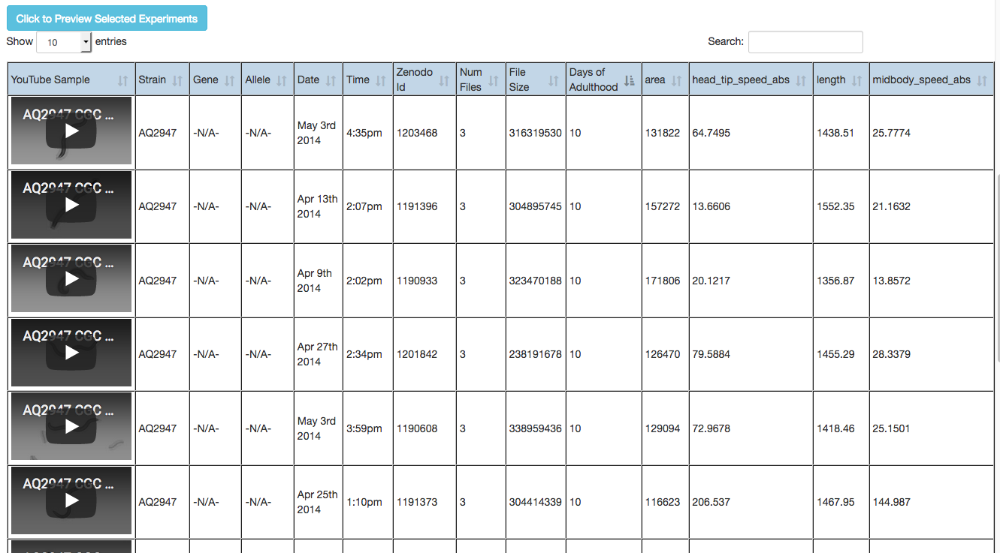
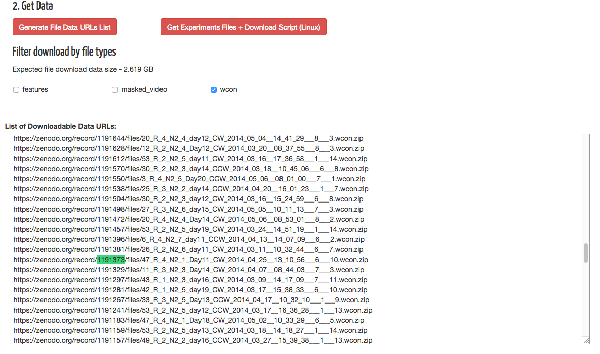
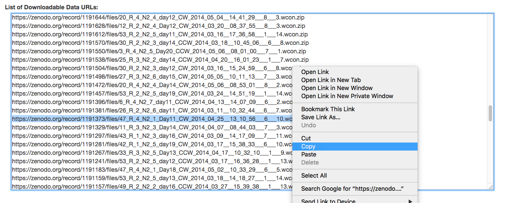
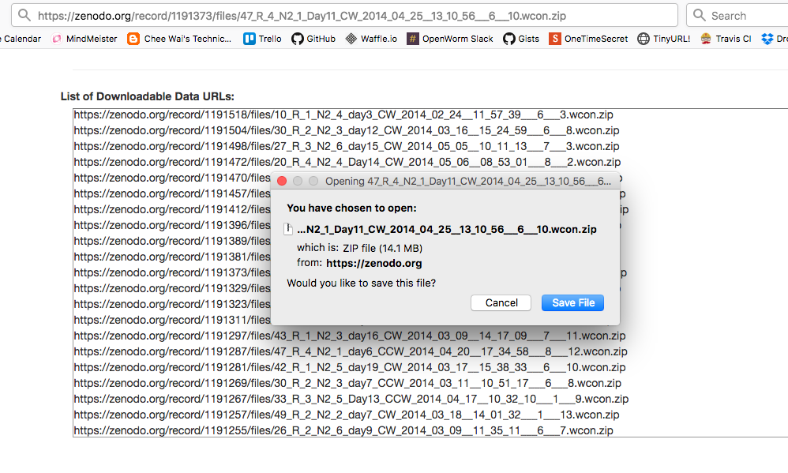

# Movement Database Tutorial

## Downloading Experiments Data

**Click on** the "Get Data Here" button. This brings up a new
interface to look at the set of experiments you had selected for
download.

**Click on** the "Click to Preview Selected Experiments" button. This
brings up a browseable table with details on the experiments
selected, with an embedded Youtube sample of the worm's movement.

We want a younger worm to look at, so **click on** the "Days of
Adulthood" header of the table to get it to sort the preview
accordingly. The worm data with Zenodo ID "1191373" looks interesting
in that it moves relatively fast, so remember that because we want to
look at it later.

**Scroll down** to the bottom of the page, and **click on** the
"Generate File Data URLs List" button. Now **uncheck** "features" and
"masked_video".  **Search** the resulting list to find Zenodo ID
"1191373." Your browser's search feature will work on this list.

Each line is a URL where we can acquire the desired data. For this
tutorial, we are only interested in this single entry. **Select** the
text of the whole line for "1191373" and **copy** the text string.

**Paste** the text into your browser navigation bar and navigate to
it. You will be asked to accept the download of the zip file.

------

[Previous - Crossfilter](Tutorial-2.md)
[Next - View WCON Files](Tutorial-4.md)

