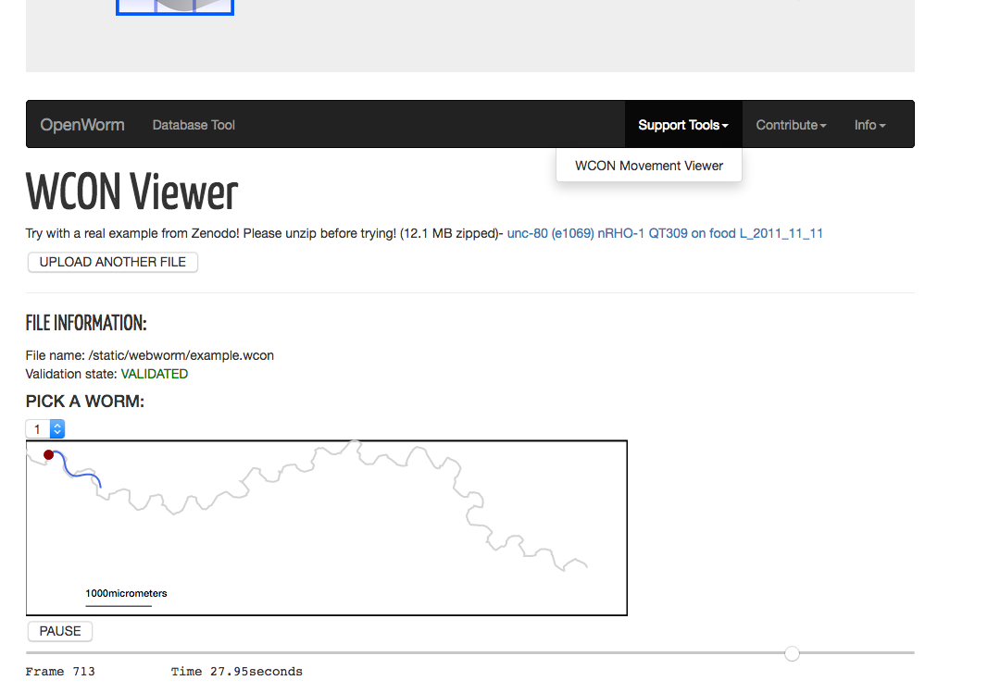
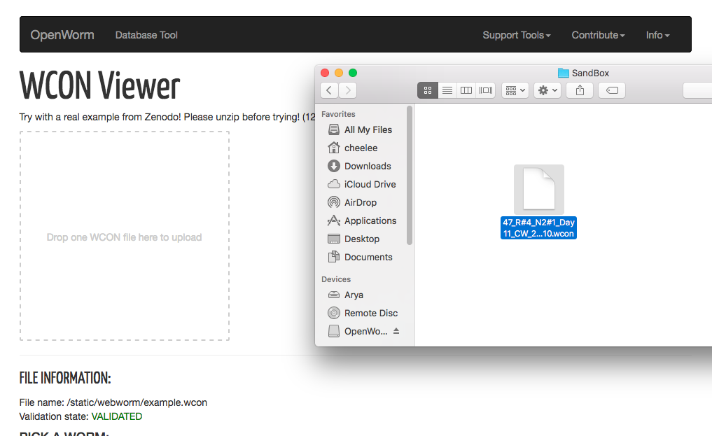
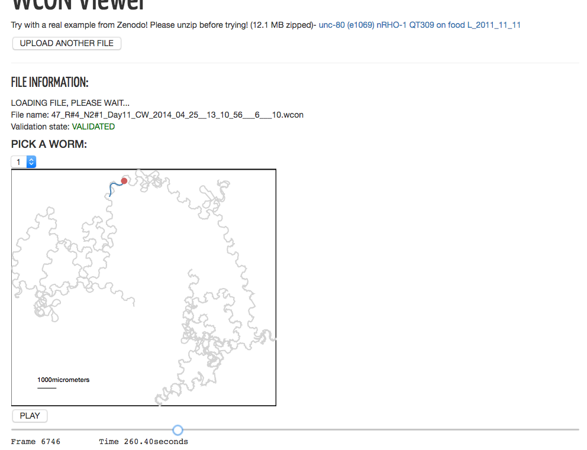

# Movement Database Tutorial

## Looking at Worm Movement WCON Data

After the file is downloaded, **unzip it**. Now from the Database
Interface, find the "Support Tools" option on the Navigation Bar and
**click on** "WCON Movement Viewer." This brings up the tool to view
WCON data. There is default data that is loaded when you first visit
the tool.

We will now load the data you had just downloaded using the database
from before. **Click on** the "Upload Another File" button. This
expands into an area where you can drag-and-drop files into. Using
your system's interface, **drop the unzipped WCON file** you had acquired
from before into this box.

You should now see what the worm from experiment "1191373" does, and
browse through its movement characteristics over time using the tool.

This ends the tutorial.

------

[Previous - Download Data](Tutorial-3.md)
