# Movement Database Tutorial

## Background

The movement database captures metadata concerning experiments that had been conducted studying the movements of C. Elegans nematode worms. Where available the metadata includes information about access to full scientific experimental data stored in other database repositories. As of this writing, we have support for data stored in
[Zenodo repositories](https://zenodo.org/).

:warning: We welcome any suggestions for improvements or
features. Please drop us a message or issue on our [Github
repository](https://github.com/openworm/movement_cloud) or via our [feedback form](https://goo.gl/forms/4ryQpnlkJRhAv7vx1).

## Use-Cases

This movement database interface allows users to:

1. Find experiments using features means as parameters (along with date and worm age), from a subset of experiments drawn from the database. This is done using a crossfilter mechanism. The tool will initially load with all experiment records from the full database.

2. Search for specific experiment subsets by field (e.g. Genes, Alleles etc ...) values, and apply that to the database display.

3. Get a features means metadata file for experiments found. This is in the form of comma-separated-values (csv) file that can be imported into a spreadsheet. The user can control which set of features values get inserted into this file.

4. Get experiment data files (hosted on Zenodo) associated with experiments found. We currently cannot support direct download of files from the interface, but we do provide two mechanisms to allow users to download the experiment files by other means.

5. View and validate WCON-formatted movement data files.

6. Make requests to contribute their own datasets to the database.

## Workflow

The user will encounter the following landing page when accessing the database interface for the first time.

:warning: As of this writing, we have a public test server at
[http://movement.openworm.org/](http://movement.openworm.org/).

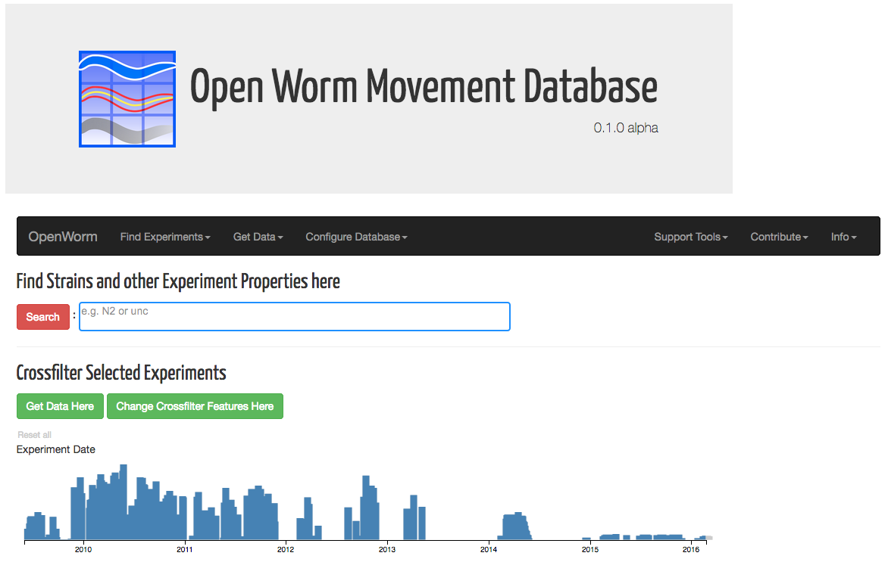

The landing page will begin with the crossfilter tool (Menu item: **_Find Experiments_** -> **_Crossfilter_**) using a
set of default features, and be applied to all experiments currently available on the database.

There will also be a convenient search bar where users familiar with the datasets they want, may specify search terms to limit the experiments the database displays. These search terms are applied to fields such as Genes names, Alleles, Strains, or the names of Experimenters. An autocomplete feature helps users narrow down search terms quickly.

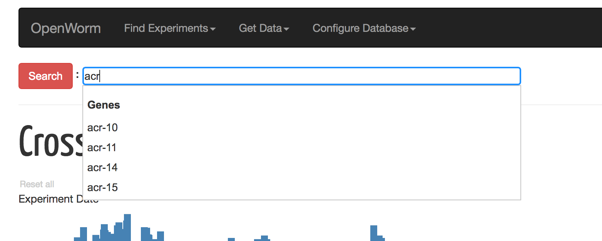

Users unfamiliar with experiments stored in the database may also browse fields via Find Experiments -> Browse and Filter Database. All available search fields are listed in tables in this view along with the approximate number of experiments available in the database for any particular search value.

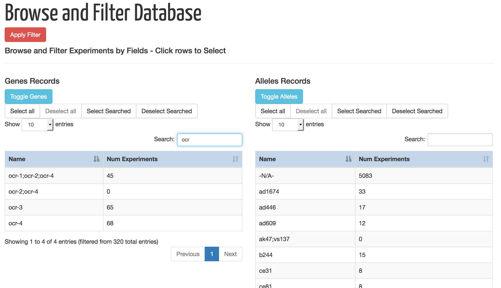

### Find Experiments via Crossfilter

Using the crossfilter tool is simple. Clicking and dragging the mouse along any part of any of the crossfilter bar charts sets a range for the values on the x-axis on which to restrict the search. The height of each bar represents the number of experiments in the value-range of
that bar. Restricting the range of one chart automatically eliminates valid ranges and values for the other charts. Each chart can be independently reset. The "reset" link shows up for any chart where a range is active. There is also a global "Reset all" available above the Experiment Date chart.

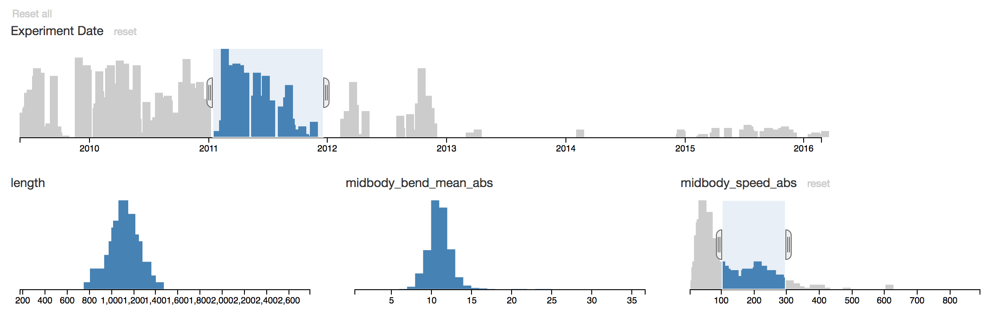

The result is a set of experiments with features values that are constrained by all applied crossfilter ranges. At the bottom of the page is a dynamic preview of a subset of 20 experiments that belong to the full set of constrained experiments. This serves as a rough preview,
and has links to youtube video samples of the worm movements should one wishes to watch at this stage of the search.

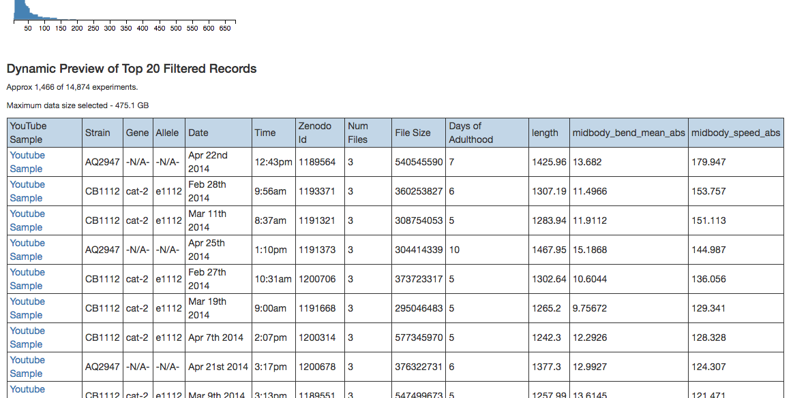

:warning: A fuller table of selected experiments with embedded youtube samples is available for full browsing when the user wishes to download the data. Please do not feel unnecessarily constrained by the limited preview above.

Experiment Data and Days of Adulthood are fixed crossfilter parameters in this tool. Users may change any of the other parameters by **_Configure Database_** -> **_Change Crossfilter Features_**.

### Getting Data

When satisfied with the crossfilter parameters, users may select any of the options in the "Get Data" menu item. Users can always return to the crossfilter view by **_Find Experiments_** -> **_Crossfilter_** to change the parameters at any time. All state is preserved for between these shifts in views.

#### Features Means Data

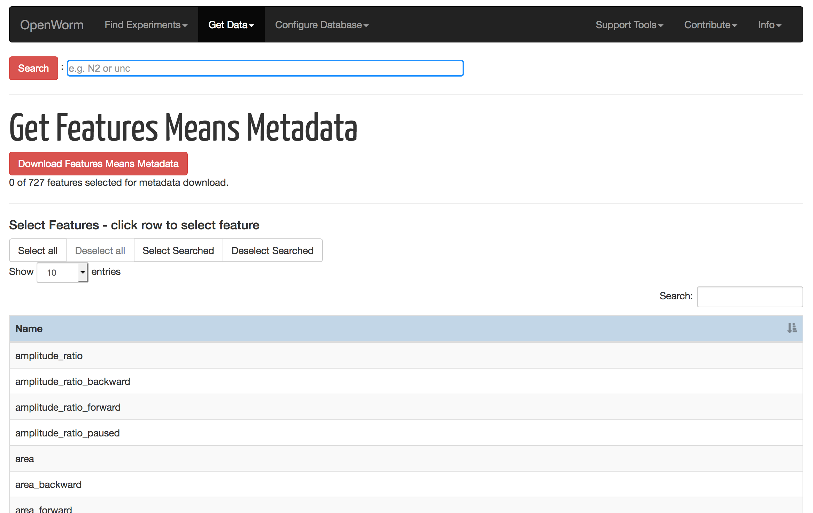

Menu navigation **_Get Data_** -> **_Features Means_** brings us to this view. To download a csv file containing features metadata, users can first select
the set of features using the "Select Features"
table. Features are toggled by clicking on appropriate row. The features chosen here are orthogonal to the features used as parameters in the crossfilter tool.

The top-right "Search:" box can also be used to filter for partial keywords, select individual features from that list, or all of the partial matches using the "Search Selected" button. Users can filter on other partial keywords using the "Search:" box without losing any of the prior selections.

When satisfied with the selection, the "Download Features Means Metadata" button sends the request to the server. The experiments with features data will correspond to the set of experiments found earlier using the crossfilter tool.

:warning: The download can take a bit of time, depending on the number of features and experiments selected. Users may have to wait around a minute to get the entire database with all features.

When successful a "results.csv" file will be generated and downloaded to the user's local machine. This file can then be import into a spreadsheet.

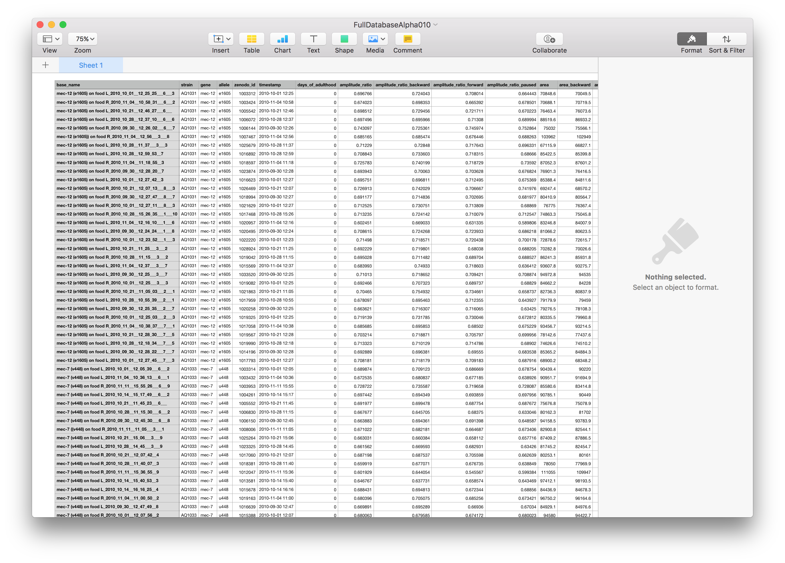

The data acquired consists of columns including the given name for the experiment, the strain, the gene, the allele, the zenodo id, the time stamp of the experiment, the age of the worm in days, and a column for each feature selected.
Each row represents an experiment and the rows are sorted by ascending strain values.

#### Zenodo Data

Menu navigation **_Get Data_** -> **_Zenodo Data_** brings us to this view. The "Click to Preview Selected Experiments" button produces a browsable and searchable table listing all of the experiments found by crossfilter. Each row of this table represents an experiment file
associated with a selected experiment. At the top left corner the number of rows displayed can be adjusted from 10 to 100. At the top right corner a dynamic search textbox allows you to find records by partial text matches. At the bottom of the table users may browse pages of the experiment records. Youtube sample video embeds are also included where available.

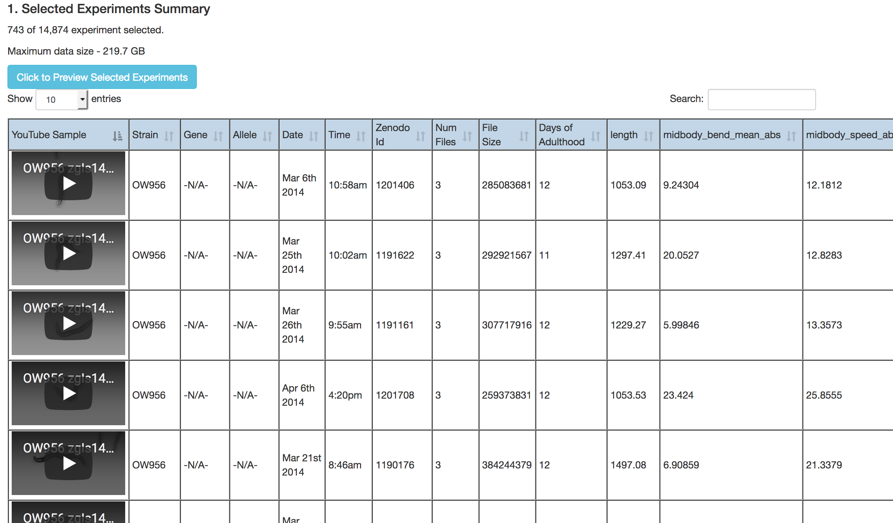

#### Acquisition of Experiment Data Files

At the bottom of the page are file type checkboxes. These can be used to exclude certain types of experiment file types from download. For example the full uncompressed hdf5 video files of captured worm movements can be very large, and not desirable. Unchecking the "masked_video" box will exclude them. The expected download sizes are dynamically updated in response to the selection of checked boxes.

Lacking a way for users to directly download files from the tool itself, we provide two mechanisms for getting Zenodo data.

##### Generated list of Experiment File URLs.

The first mechanism to acquire experiment data files involve generating a list of URLs users can copy and paste into third-party download software or plugins. Users can do this by clicking on the "Generate File Data URLs" button. This creates a textbox with a list of URLs.

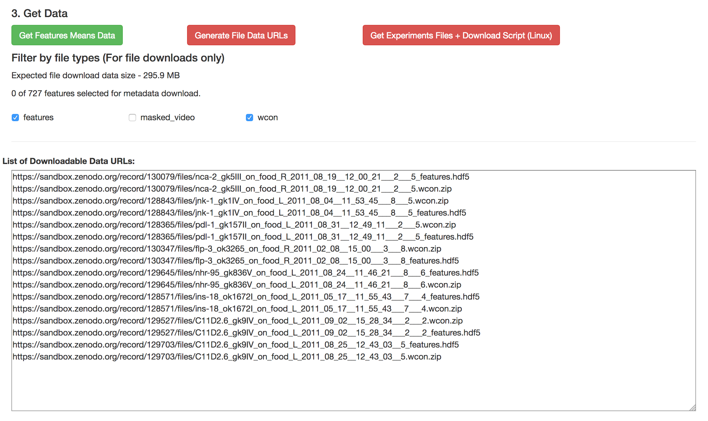

Users may select and copy individual lines, and paste them into browser navigation bars. They can also use 3rd party plugins like this download plugin (e.g. [Tab Save](https://github.com/lmmx/tabsave/)) for Chrome shown below.

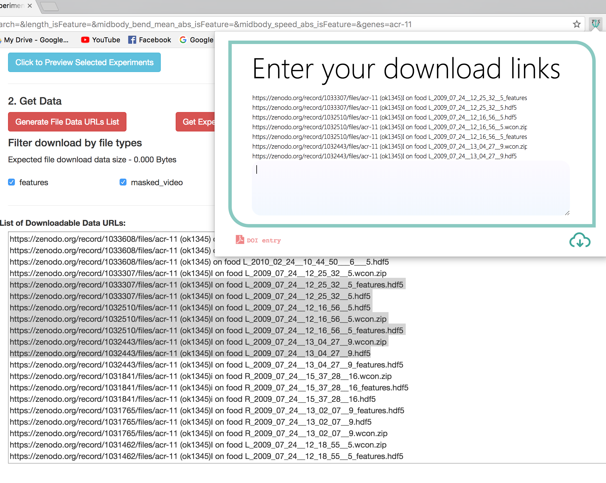

##### Download Script Package

The second mechanism has our tool generate a download package ("movement_data_download_package.zip") for POSIX/Linux/MacOSX systems. This package contains:
  * A bash shell download script
  * A file containing download data based on zenodo ids and file names.  
  * Instructions.

Using the download script on a Linux machine will make use of wget to download all files into a folder structure corresponding to zenodo ids.

## WCON Viewer

Menu item **_Support Tools_** -> **_WCON Movement Viewer_** brings us to this tool. The tool opens in a new window to avoid disruption to the state of the main database tool. The initial view loads a default example worm. A link to a larger WCON data file hosted on Zenodo is provided for users to try uploading to this tool if they do not have WCON files of their own.

:warning: As an exercise, users may wish to try searching the database for interesting worms, acquire the appropriate WCON file from Zenodo, and drop it into this tool.

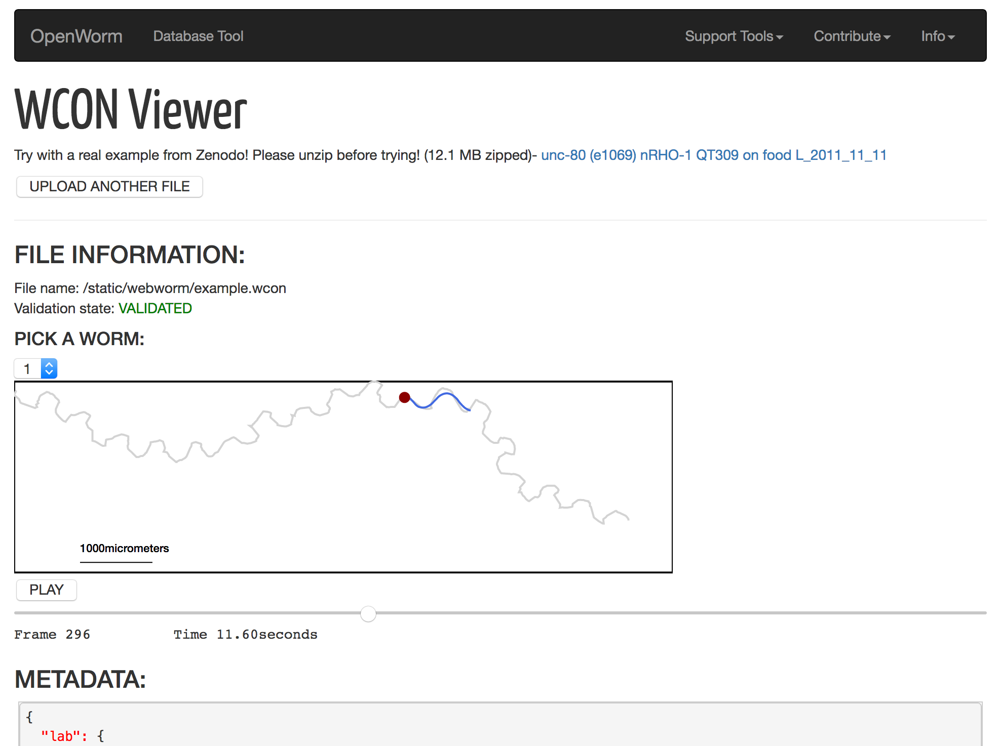

Clicking on the "UPLOAD ANOTHER FILE" button expands a drag-and-drop area where users may drag WCON files they possess on their local machines.

Upon doing so the tool will attempt to parse and validate the schema of the uploaded WCON file (which are JSON files.) Often the viewer will continue to work in spite of some validation errors.

In the visualization box, the red dot represents the head of the worm, and the blue line represents its body. The body's articulation can vary depending on the data. The grey line represents the worm's track over time. More than one worm may be found in a WCON file. If so, this tool will allow users to choose the worm to visualize by the drop-down selection under the "PICK A WORM" label. Users may pause and restart the animation at any time. The middle mouse scroll and certain trackpad gestures allow the user to zoom in and out inside the view.

Below the main visualization, metadata information associated with the data file is presented, along with the units used, and details about each worm in the loaded WCON file.

:warning: As of this writing, this viewer tool may not fully handle all possible forms of valid WCON files. We are working toward full format compatibility in future work. The viewer will however handle the most common forms.

## Notes

* Details about how each individual feature (e.g. crossfilter, table browsing, etc ...) found in this tool are documented in our [Features Documentation](Features.md).

* Users who wish to contribute their own datasets to the database may make a request via the form in **_Contribute_** -> **_Upload your Data_**. We will work with you to get your data uploaded to the server, and will gladly acknowledge your contribution in the tool view **_Contribute_** -> **_Contributors List_**.
