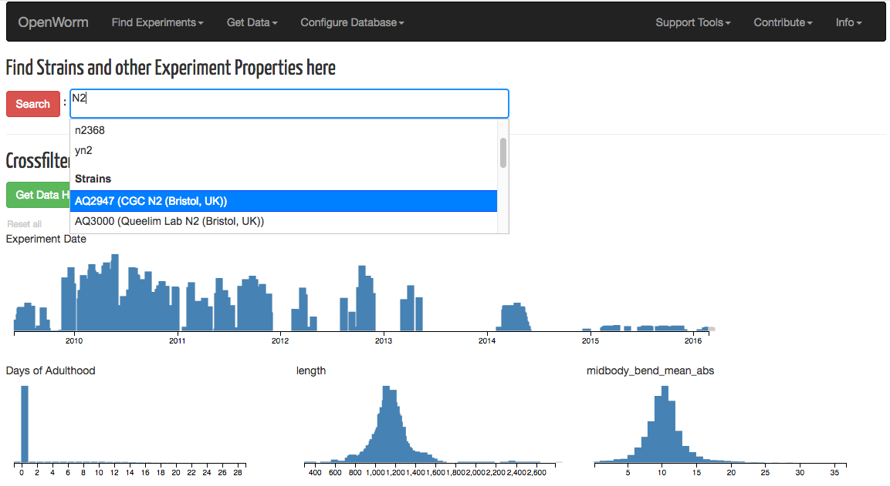
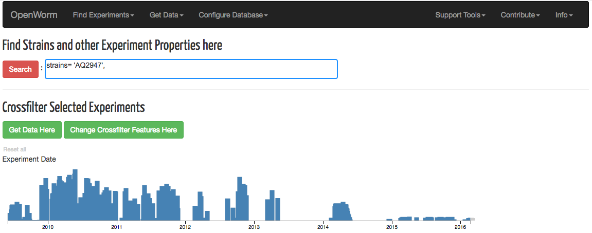
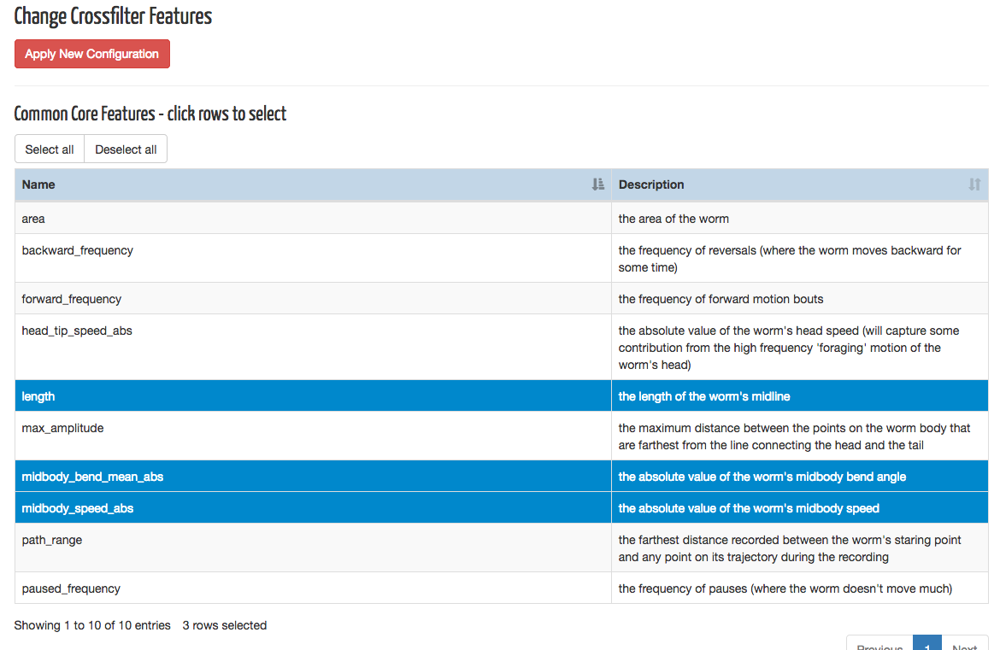
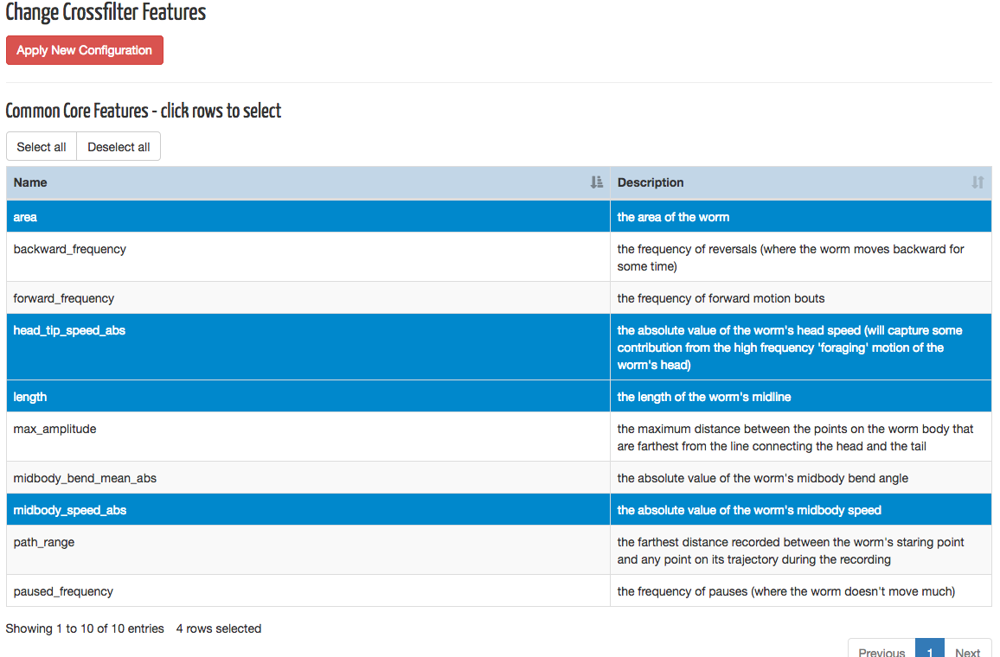
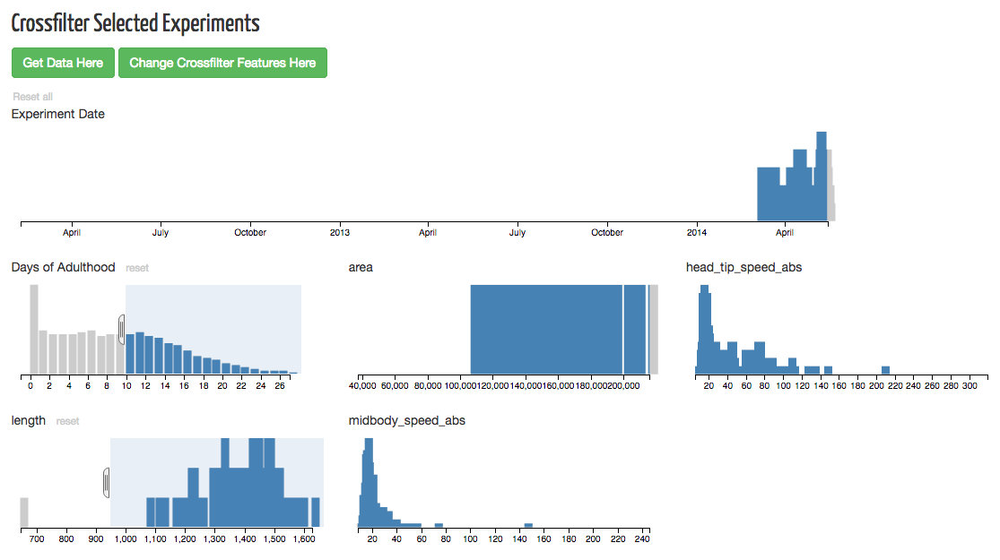

# Movement Database Tutorial

## Load Database on Browser

**Navigate** to [http://movement.openworm.org/](http://movement.openworm.org/).

The database should not take more than 30 seconds to load. You should
see the following landing page after it loads.

## Use the Search Bar

The full database is loaded at the start. The **search bar** lets you
choose specific subsets of the database to load. 

**Type "N2" into the search bar**. You will see a list of matches with
different categories. Use the mouse to **scroll down** to the _Strains
category_ and **click on the row** "AQ2947 (CGC N2 (Bristol, UK))."

You will see that the tool has filled out the search line with the
appropriate details like below. **Click** on the "Search" button.

The database will now reload with only that strain's data. Notice how
the crossfilter charts have changed accordingly.

## Crossfilter Results

The **crossfilter** tool lets you dynamically refine the search by a
set of features means values. The "Experiment Date" and "Days of
Adulthood" charts are always available to crossfilter against. The
other features can be added or removed.

**Click on** the "Change Crossfilter Features Here" button. This takes
you to the tool that lets you change crossfilter feature sets. The
highlighted rows in the list of "Common Core Features" are currently
what is available for crossfilter.

**Click on** the "midbody_bend_mean_abs" row to deselect it. 
Now **click on** the "area" and "head_tip_speed_abs" rows to
select them. Notice how the table highlight changes.

**Click on** the "Apply New Configuration" button. The database
will now reload.

Now we want only the long worms 10 days and older. Use the mouse to
**drag along** the "length" chart so only the worms longer than 900
are selected.

Notice how the other charts react to this change. Also notice how the
"Dynamic Preview" table changes with your actions as well. **Repeat**
for the "Days of Adulthood" chart with worms 10 days and older. The
charts should now look like the following.

## Downloading Experiments Data

**Click on** the "Get Data Here" button. This brings up a new
interface to look at the set of experiments you had selected for
download.

**Click on** the "Click to Preview Selected Experiments" button. This
brings up a browseable table with details on the experiments
selected, with an embedded Youtube sample of the worm's movement.

We want a younger worm to look at, so **click on** the "Days of
Adulthood" header of the table to get it to sort the preview
accordingly. The worm data with Zenodo ID "1191373" looks interesting
in that it moves relatively fast, so remember that because we want to
look at it later.

**Scroll down** to the bottom of the page, and **click on** the
"Generate File Data URLs List" button. Now **uncheck** "features" and
"masked_video".  **Search** the resulting list to find Zenodo ID
"1191373." Your browser's search feature will work on this list.

Each line is a URL where we can acquire the desired data. For this
tutorial, we are only interested in this single entry. **Select** the
text of the whole line for "1191373" and **copy** the text string.

**Paste** the text into your browser navigation bar and navigate to
it. You will be asked to accept the download of the zip file.

## Looking at Worm Movement WCON Data

After the file is downloaded, **unzip it**. Now from the Database
Interface, find the "Support Tools" option on the Navigation Bar and
**click on** "WCON Movement Viewer." This brings up the tool to view
WCON data. There is default data that is loaded when you first visit
the tool.

We will now load the data you had just downloaded using the database
from before. **Click on** the "Upload Another File" button. This
expands into an area where you can drag-and-drop files into. Using
your system's interface, **drop the unzipped WCON file** you had acquired
from before into this box.

You should now see what the worm from experiment "1191373" does, and
browse through its movement characteristics over time using the tool.

This ends the tutorial.

