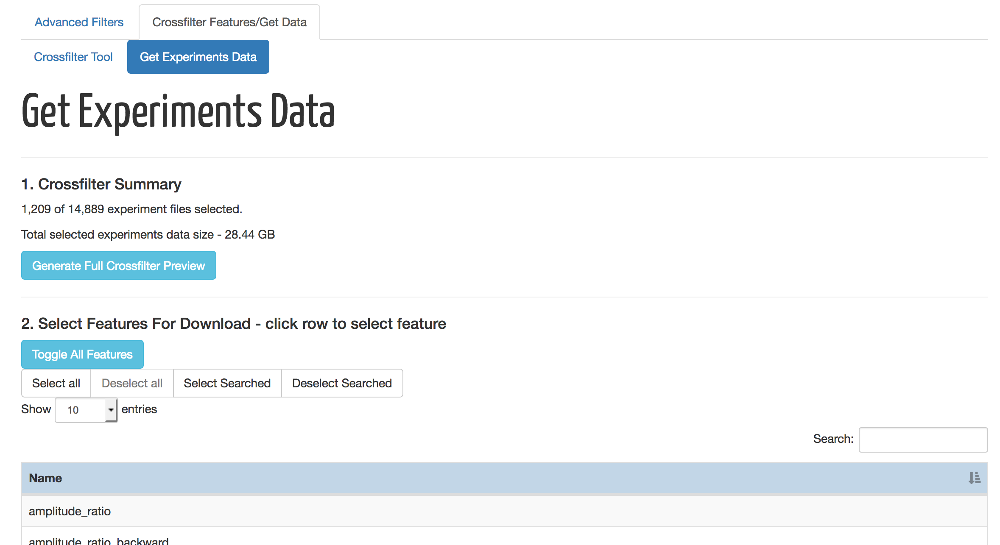
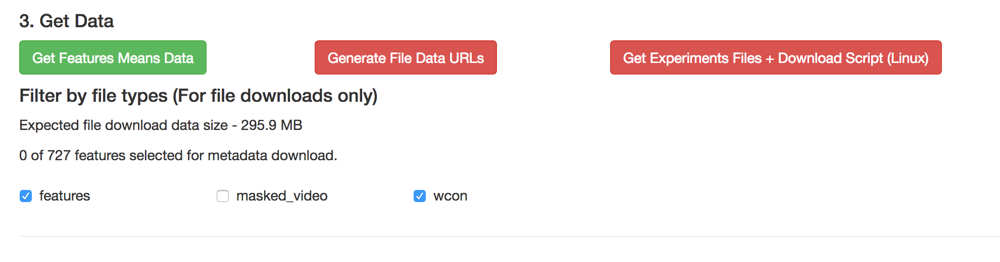

# Movement Database Tutorial

## Background

The movement database captures metadata concerning experiments that
had been conducted studying the movements of C. Elegans nematode
worms. Where available the metadata includes information about access
to full scientific experimental data stored in other database
repositories. As of this writing, we have support for data stored in
[Zenodo repositories](https://zenodo.org/).

:warning: We welcome any suggestions for improvements or
features. Please drop us a message or issue on our [Github
repository](https://github.com/openworm/movement_cloud).

## Use-Cases

This movement database interface allows users to:

1. Search the database for experiments based on features means.  The
primary mechanism for doing so is via the
[crossfilter](http://square.github.io/crossfilter/) mechanism.

2. Download a file that can be import into a spreadsheet. This file
contains metadata about each selected experiment. The user can control
which set of features values get inserted into the file.

3. Download experiment data files associated with selected experiments.
We currently cannot support direct download of files from the
interface, but we provide two mechanisms to support the downloading of
selected experiment files via other means.

## Workflow

The user will encounter the following landing page when accessing the
database interface for the first time.

:warning: As of this writing, we have a public test server at
[http://movement.openworm.org/](http://movement.openworm.org/).

The landing page will begin with the crossfilter tool (tab
"Crossfilter Features/Get Data" and subtab "Crossfilter Tool") using a
set of default features, and be applied to all experiments currently
available on the database.

### Search via Crossfilter

Using the crossfilter tool is simple. Clicking and dragging your mouse
along any part of any of the crossfilter bar charts sets a range for
the values on the x-axis on which to restrict the search. The height
of each bar represents the number of experiments in the value-range of
that bar. Restricting the range of one chart automatically eliminates
valid ranges and values for the other charts. Each chart can be
independently reset. There is also a global "Reset all" available
above the Experiment Date chart.

The result is a set of experiments with features values that are
constrained by all applied crossfilter ranges. At the bottom of the
page is a dynamic preview of the 20 experiments that belong to the
full set of constrained experiments. This serves as a rough preview,
and has links to youtube video samples of the worm movements should
one wishes to watch at this stage of the search.

:warning: A fuller table of selected experiments with embedded youtube
samples is available later for full browsing. Please do not feel
unnecessarily constrained by the limited preview above.

There is also a summary of the number of experiment files (there can
be more than one associated with each experiment) captured in the
crossfilter search. Each Zenodo ID is uniquely associated with an
experiment, so users can make sense of multiple entries with the same
features values data. The total file sizes of all experiment files in
the resulting search is also reflected.

### Getting Data

When satisfied with the crossfilter process, click on the "Get
Experiments Data" subtab. You can return to the "Crossfilter Tool"
subtab to re-filter at any time. At the top of the page is the summary
of the results of the prior crossfiltering.

Clicking on the "Generate Full Crossfilter Preview" produces a full
preview of the experiments that were selected in the last crossfilter
exercise. Each row of this table represents an experiment file
associated with a selected experiment. As above, Zenodo IDs uniquely
identify experiments. At the top left corner the number of rows
displayed can be adjusted from 10 to 100. At the top right corner a
dynamic search textbox allows you to find records by partial text
matches. At the bottom of the table you may browse pages of the
experiment records. Youtube sample video embeds are also included
where available.

We provide two forms of data acquisition support.

1. Features Metadata Download

Select a set of features. These features do not have to be the same as
the set of features used to perform the crossfilter. You can then
download a file that can be import into spreadsheets containing some
base information about the crossfiltered experiments along with the
values of the set of selected features.

2. Support for Experiment Files Download

The interface currently provides no direct download support for
acquiring experiment files from Zenodo. However we provide two
mechanisms to allow users to download these files by other means. The
first mechanism generates a list of URLs in a text box users can
copy. The second produces a download script package that can be
executed in a POSIX/Linux/MacOSX environment to download the desired
files.

#### Downloading Features Metadata

To download a file containing features metadata, you can first select
the set of features using the "Select Features For Download"
table. You can toggle selection by clicking on each row.

You can also use the top-right "Search:" box to filter for partial
keywords, select individual features from that list, or all of the
partial matches using the "Search Selected" button. You can filter on
other partial keywords using the "Search:" box without losing any of
the prior selections.

After you are satisfied with the selection, scroll down to the "Get
Data" section and click on the "Get Features Means Data" button.

:warning: The download can take a bit of time, depending on the number
of features selected.

:warning: The file type checkboxes at the bottom of the page have no
effect on this download feature.

When successful a "results.csv" file will be generated and downloaded
to your machine. This can be imported into a spreadsheet.

The data acquired consists of columns including the given name for the
experiment, the strain, the gene, the allele, the zenodo id, the time
stamp of the experiment, and a column for each feature selected prior.
Each row represents an experiment (rather than experiment file as
before) and the rows are sorted by ascending strain values.

#### Acquisition of Experiment Data Files

At the bottom of the page are file type checkboxes. These can be used
to exclude certain types of experiment file types from download. For
example the full uncompressed hdf5 video files of captured worm
movements can be very large, and not desirable. Unchecking the
"masked_video" box will exclude them.

The filter will apply to both available ways to acquire experiment
file data as described below.

1. The first way to acquire experiment data files involve generating a
list of URLs users can copy and paste into third-party download
software or plugins. Users can do this by clicking on the "Generate
File Data URLs" button. This creates a textbox with a list of URLs.

Users can copy all or part of the text, and use in a third party
tool. Here is an example using a [Chrome
plugin](https://github.com/lmmx/tabsave/) to download 2 smaller files.

2. The second method generates a download package
("movement_data_download_package.zip") for POSIX/Linux/MacOSX
systems. This package contains:
  * A bash shell download script
  * A file containing download data based on zenodo ids and file names.  
  * Instructions.

Using the download script on a Linux machine will make use of wget to
download all files into a folder structure corresponding to zenodo
ids.

## Notes

This tutorial will not cover the optional "Advanced Filter" features
used to constrain the set of database records prior to
crossfilter. This can be useful for people who wish to crossfilter on
features other than the default ones, or constrain the search to
specific parameters such as the set of strains, or
experimenters. Details on how to use the Advanced Filter, as well as
key interface components may be found [here](Features.md).
